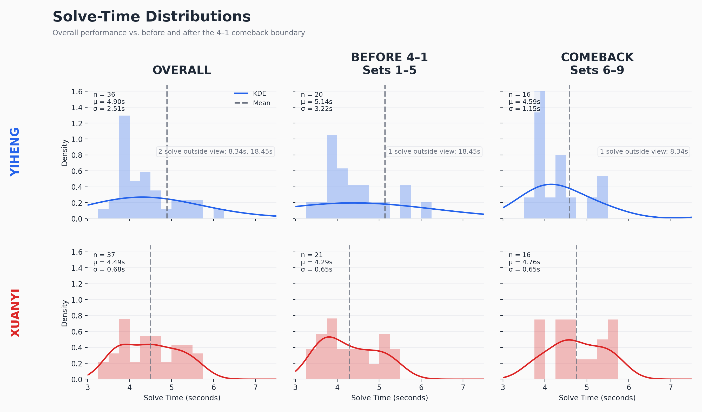
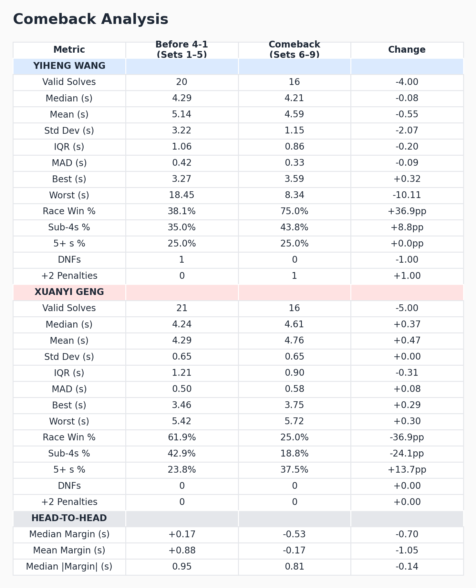

# Monkey League S6 Grand Final: A Statistical Analysis

An exploratory sports analytics and data visualization project analyzing the 5–4 comeback in the Monkey League S6 Grand Final between Yiheng Wang and Xuanyi Geng.

## Project Overview

This project quantifies and visualizes how a 4–1 deficit for Yiheng Wang turned into a 5–4 victory against Xuanyi Geng. The analysis focuses on performance shifts before the comeback boundary (Sets 1-5) and during the comeback (Sets 6-9).

## Highlights

### Solve-Time Distributions



### Comeback Performance Breakdown



## Directory Structure
- `data/raw/`: Contains the manually collected grand final dataset.
- `src/`: Python source code containing data preparation, visual pipeline, and markdown report generation.
- `outputs/figures/`: High-resolution analytical visualizations generated by matplotlib.
- `outputs/reports/`: Programmatically generated markdown statistical reports.

## Running the Analysis
You can execute the entire analysis pipeline by running:
```bash
python src/analysis.py
```
